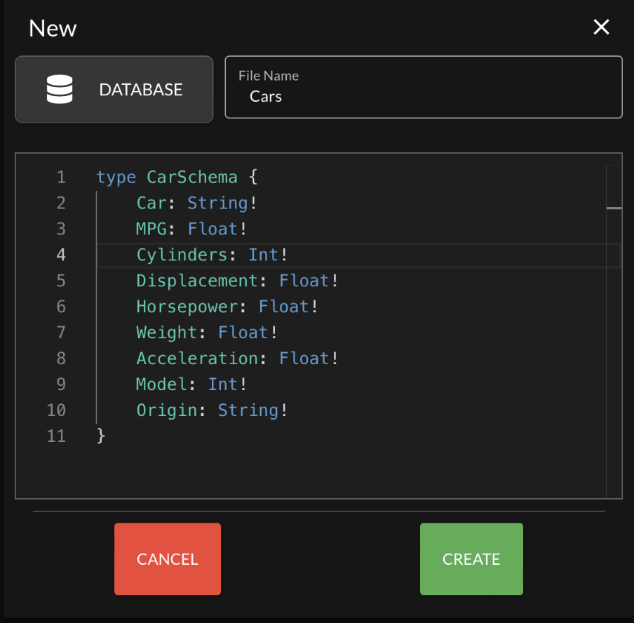
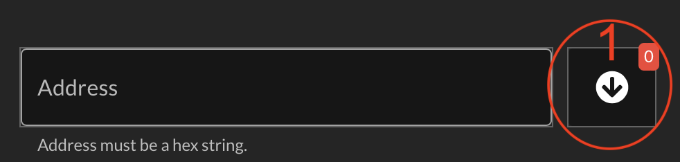
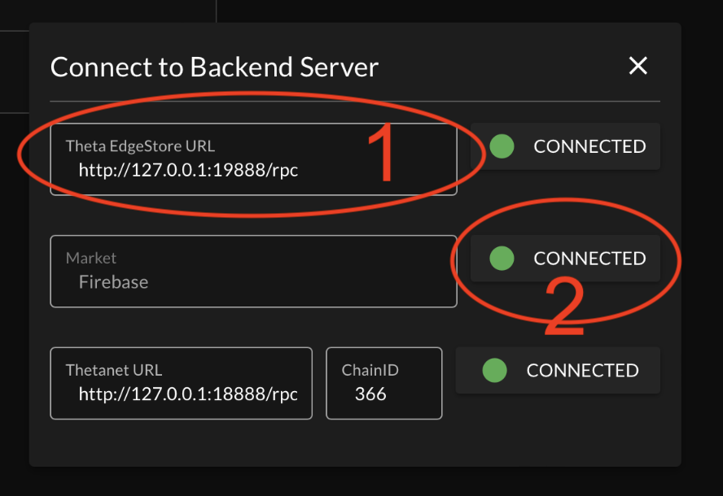
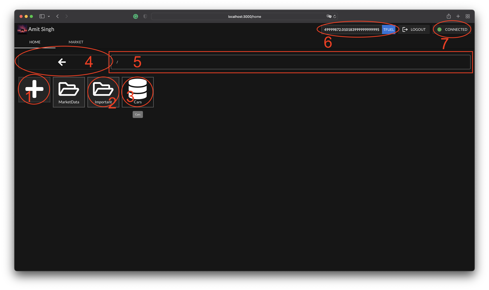
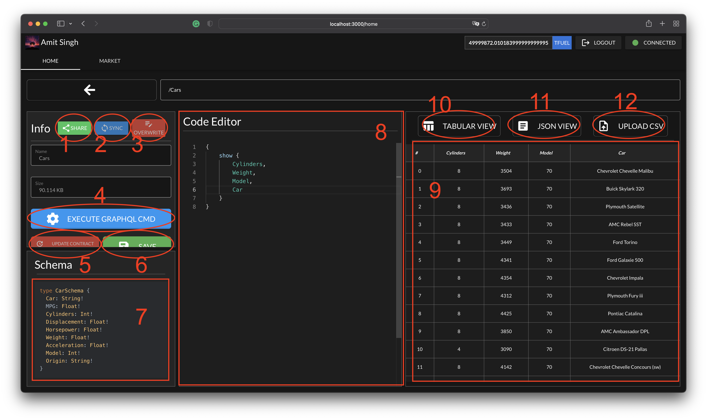
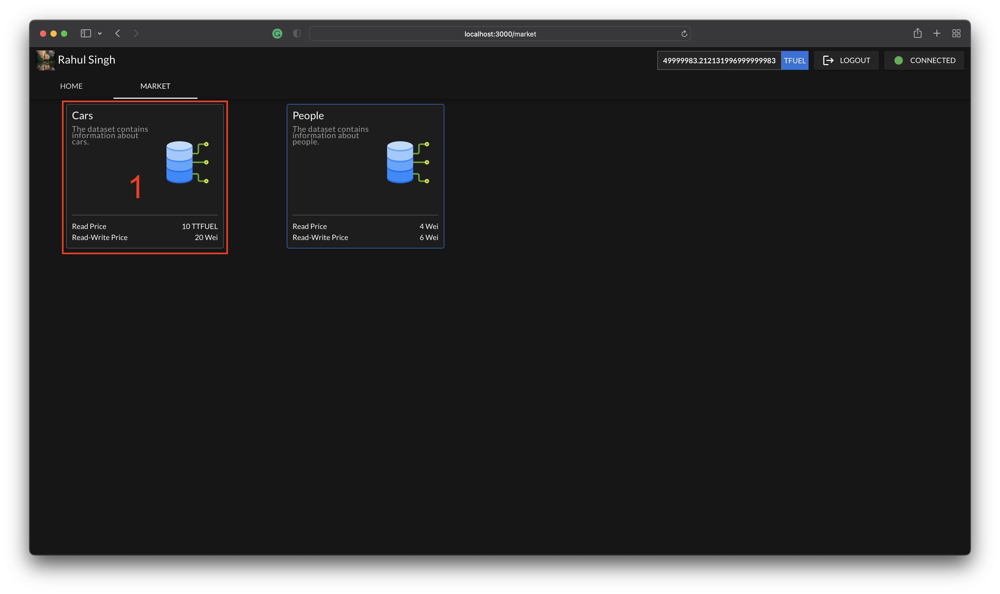

# Theta Hackathon

Since our college days, I have participated in competitions and even worked on projects that would require datasets, but it was tough to find them. One of the main reasons was that there was no incentive for people to collect them or make them public. On top of it, the sources were fragmented. There is no common place where you can search or download data.
Secondly, there is an inherent problem with the data sold; there is no accountability or way to track data, who got it from whom or who sold it to whom.
Lastly, there is no way to collaborate where one creates the data, and anyone who has write permission can update the dataset.

So, I made it my mission to solve these problems. As I was looking for the solution, I came across NFT. It partly solved the problem, but it was enough to inspire me to create a Shareable Token that could be shared among people. Furthermore, the EdgeStore allowed us to store a large amount of data on CDN that could do wonders when combined with Shareable Token.

OneStorage is a platform where anyone can create a dataset using GraphQL for writing schema. The schema is then parsed to get data types for checking constraints when a user pushes a row or rows, column names and data skeleton. Once the dataset is created, we use GraphQL language to mutate or query the dataset. After the dataset is populated with data, we can save it on the EdgeStore network. Afterwards, we can also share the dataset on the marketplace, where anyone can buy different permissions, such as read permission and read-write permission. If the user buys read authorisation, he cannot update the contract, and for read-write authorisation, they can also edit the contract. To make the data less heavy on the bandwidth, I have created a mini blockchain with a chunk of 1024 rows. Moreover, my app allows having a filesystem that closely emulates UNIX.

# How To Install

## Theta EdgeStore

Follow the instruction on the [here](https://docs.thetatoken.org/docs/theta-edge-store-setup) provided by the Theta Developers.

## Theta Thetanet

Follow the instruction on the [here](https://docs.thetatoken.org/docs/setup) provided by the Theta Developers. We would recommend installing Theta Localnet because 
- We have extensively tested it.
- You get free TFuels with around ten accounts, making it easier for running and testing.
## Web App (OneStorage)
1. Open a terminal
2. Clone the repo using `git clone` in your chosen directory.
3. `cd` into the cloned directory.
4. run `npm install`. It will install all the dependencies.
5. Before running on any new machine, run the `npm run resetDB` command. The reason is simple, I'm running firebase, which is global and visible to every machine, but EdgeStore and Theta blockchain are not. The filesystem that is saved on firebase is global, and the filesystem also has the contract address with the EdgeStore address that may exist on the other machine or not. These two have local addresses that may not be present on the other machine.
6. Finally, run the command `npm run dev` to run the web app.
7. Visit the localhost with port 3000, or `http://localhost:3000`.

# System

1. `MacOS` : Tested
2. `Windows`: Not Tested
3. `Linux`: Not Tested

# GraphQL

## How to write schema?
There is no need to learn a new language to write schema. We use the `GraphQL` schema language. Moreover, we use this schema to parse types and use it to check constraints or types.

<div style="display: flex; justify-content: center">
    
</div>

## Mutations

There are three mutations available:
### 1. **[`addRow`]**

The function adds a row to the dataset.

**Example:**
```typescript
mutation {
    addRow(input: { /* ColumnName : Value, ... */})
}
```
**Returns** : `true` if row is added successfully.

### 2. **[`addRows`]**

The function adds multiple rows to the dataset.

**Example:**
```typescript
mutation {
    addRows(input: [
        { /* ColumnName : Value, ... */},
        {...},
        ...
    ])
}
```
**Returns** : `true` if rows are added successfully.

### 3. **[`commit`]**

The function commits the uncommitted chunk to the EdgeStore.

**Example:**
```typescript
mutation {
    commit
}
```
**Returns** : `true` if commit was successful.

## Query

There are three mutations available:
### 1. **[`show`]**

The function fetches the already in cached chunks and displays them as specified by the users.

**Example:**
```typescript
{
    show{ 
        /* ColumnName, ... */
    }
}
```
**Returns**: `Array` of `Objects` containing columns that the user has asked for.

### 2. **[`info`]**

The function gives the dataset info.

**`Info Schema`**
```typescript

type Fields {
    name: String!
    type: String!
    description: String!
}

type Info {
    description: String!
    path: String!
    name: String!
    size: Int!
    source: String!
    height: Int!
    fields: [Fields]
}
```

**Example:**
```typescript
{
    info{ 
        name,
        fields: {
            name,
            type
        }
    }
}
```

**Returns**: `Object` containing data that the user has asked for.

### 3. **[`loadChunk`]**

The function loads chunks in the given range.

**Prototype**
```typescript
type Query {
    loadChunk(start: Int, size: Int): /* Table */
}

```
**Example:**
```typescript
{
    loadChunk(start: 0, size: 3) {
        /* ColumnName, ... */
    } // [0, 0 + 3)
}
```
```typescript
{
    loadChunk(start: 3) {
        /* ColumnName, ... */
    } // [3, 3 + inf)
}
```
<br>

# Way Around The UI

## The Signup & SignIn Input Box



**1.** The drop-down button that shows all the accounts fetched from the wallet.

---
<br>

## The Connection Dialog Box


**1.** Input Box that accepts the access point of the server. The can change by giving the new URL.

**2.** By clicking this button, you will initiate the process of checking if the connection is valid or not. If not, the button will change from a green dot to a red one.

---
<br>

## Home Page



**INFO:** All the files and Folders will open by double click and get highlighted when single clicked.
**1.** The new button helps you create a new file or folder of your choice. You can interact with it by double-clicking.

**2.** This is a folder, and it will open by double click.

**3.** This dataset will open an editor with other interactive options.

**4.** This is a back button that will take you back from anywhere you are in, within its tab.

**5.** It shows the current path you are in. You can also traverse the directory by just typing the path, and if the path is found not to be a folder but a file, it will open the file.

**Example**

```bash
/usr/desktop/../game
./test
```

**6.** This is an account balance. How much does the TFUEL the account has?

**7.** The button shows that all the three access points are connected: EdgeStore, Theta Blockchain, and Firebase. If not, you can click on the button and set the URLs.

---
<br>

## Dataset Page



**1.** This share button allows you to share the dataset and list it in the marketplace. Once you click it, you will be greeted with a dialogue box that will require you to give pricing and a description of the dataset.

**2.** This Sync button will let you sync with the updated contract, but it will not overwrite your local data. If you want to reset to local data, click the back button, then return. It will reset to the local data.

**3.** This button will overwrite your local changes with the updated one if available, and you will lose all the local data you might have updated.

**4.** This button will execute your `GraphQL` query or mutation. If the query is empty, it will fetch all data that has been cached and display it in the right column.

**5.** This button will allow you to update the contract if you have the write access.

**6.** This button will let you save the data on the `EdgeStore`. If there is no new data to save, it will be disabled.

**7.** This section shows the dataset's schema in `GraphQL` schema language.

**8.** This section allows you to code/write the `GraphQL` queries or mutations.

**9.** This section shows the data in tabular or JSON forms.

**10.** This button lets you switch to tabular form.

**11.** This button lets you switch to the `JSON` form.

**12.** This button will open a native file picker and let you pick a `CSV` file to upload but be cautious because names in the schema must be the same as the `CSV` specifies in the columns.

---
<br>

## Dataset Contract in the Marketplace [Owner's View]


**1.** This section provides information about the owner of the contract.

**2.** This section provides the names and types of the dataset. If a user selects a row, its description will show on the description side if available.

**3.** This section shows the descriptions of the dataset and fields. If no field is selected, it shows the description of the dataset. Also, the reset button will reset the description to the dataset description from the field description if it has been selected at some point in time.

**4.** This text box shows the contract balance, that is, how much `TFUEL`  does it have. It will be updated as users buy the dataset. The coins do not transfer to your account directly because to save gas, and if you withdraw as a batch, you pay less gas price than a single transaction. Furthermore, it can only be seen by the owner of the contract.

**5.** This will let you withdraw the coins directly to your account, and the owner can only see it from the contract.

**6.** This button allows you to save the dataset in your filesystem.

**7.** This will close the dialogue box you are seeing.

---
<br>

## Dataset Contract in the Marketplace [Customer's View]


**1.** This text box shows the price to buy particular access.

**2.** This button will open a dialogue box that will ask you to select which access level you want to buy.


---
<br>

## Marketplace



**1.** To interact with this card, you can single click. This card contains the pricing for the access levels and a dataset description.
